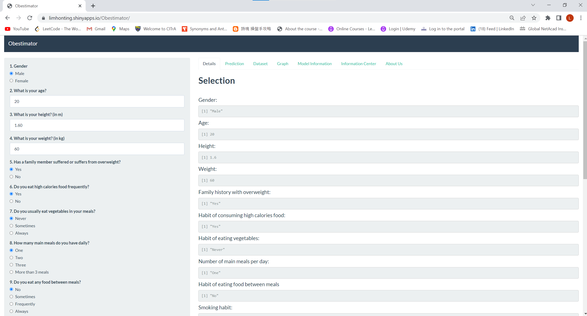

## Introduction

>This presentation is part of the course project for the *WIE2003* Introduction to Data Science.

>Based on *World Health Orgranization (WHO)*, worldwide obesity has nearly tripled since 1975.

>Therefore, we decided to develop a shiny application to monitor people's obesity levels. 

>Our application *(Obestimator)* is developed and now available at:
https://limhonting.shinyapps.io/Obestimator/

## Obestimator

>This application, called Obestimator will predict different obesity levels of the users based on their gender, age, height, weight, family history and etc.

>We have found a dataset which is suitable to train our model from Kaggle and we used R language to clean the data and build the model.

>Source code for *ui.R* and *server.R* code are available on the GitHub : https://github.com/LimHonTing/Obestimator

## Description of Our Model

>Our application has implemented multiclass classification using logistic regression.

>We have tested our model using random 30% data from the dataset and achieved around 96% of accuracy.

>After the prediction, our application will offer some suggetions to the users based on their obesity level.

## Screenshot of Obestimator

<!-- Limit image width and height -->

<!-- Center image on slide -->

Try out Obestimator here:
https://limhonting.shinyapps.io/Obestimator/

## Key Takeaways
>Cause of obesity and overweight is an energy imbalance between calories consumed and calories expended. 

>For example, an increased intake of energy-dense foods that are high in fat and sugars and
an increase in physical inactivity due to the increasingly sedentary nature of many forms of work, changing modes of transportation, and increasing urbanization.

>The consequences of overweight are cardiovascular diseases, diabetes, musculoskeletal disorders, and the chances of getting cancer surge. 

>Obesity and overweight can be prevented by having regular physical activity, and healthier foods.
